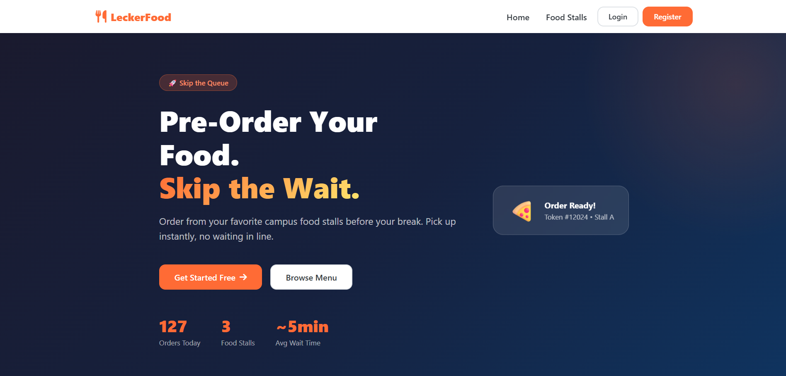
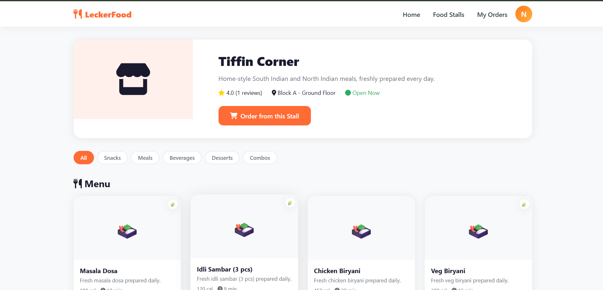
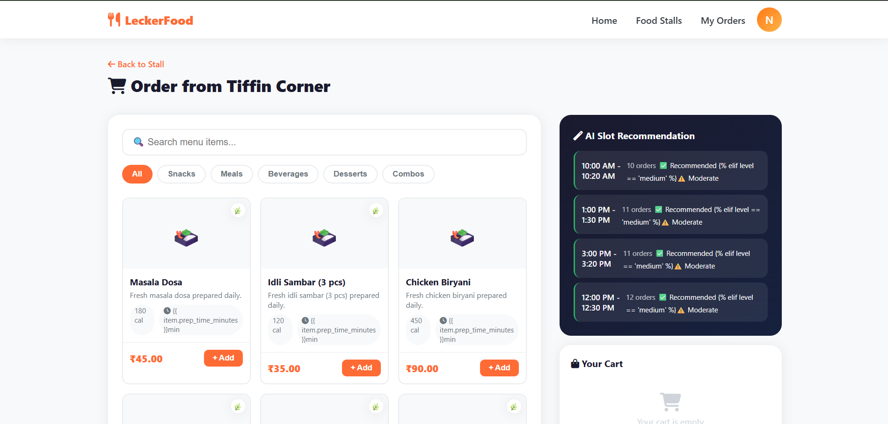
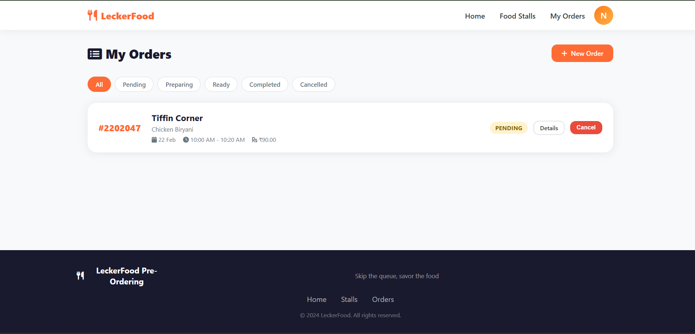
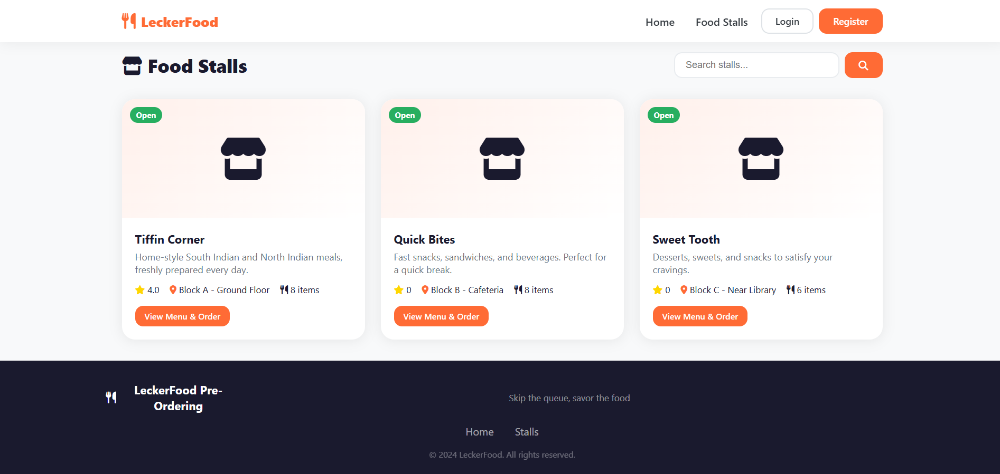

# 🍽️ Smart Food Stall Pre-Ordering System

A full-stack Django web application for campus food stall pre-ordering with real-time demand tracking and AI-based demand prediction.

---

## 🚀 Quick Start

### 1. Install Dependencies

```bash
pip install -r requirements.txt
```

### 2. Apply Database Migrations

```bash
python manage.py makemigrations users stalls orders
python manage.py migrate
```

### 3. Seed Demo Data (Optional but Recommended)

```bash
python manage.py seed_demo_data
```

This creates:
- Admin user: `admin` / `admin123`
- 5 student users: `student1` through `student5` / `pass1234`
- 3 food stalls (Tiffin Corner, Quick Bites, Sweet Tooth) with full menus
- 2 weeks of historical order data (for AI predictions to work)

### 4. Run the Development Server

```bash
python manage.py runserver
```

Open: **http://127.0.0.1:8000**

---

## 🏗️ Project Structure

```
LeckerFoodStall/
├── manage.py
├── requirements.txt
├── food_stall_project/
│   ├── settings.py          # Django settings
│   └── urls.py              # Root URL configuration
├── apps/
│   ├── users/               # Authentication & user management
│   │   ├── models.py        # Custom User model (student/admin/stall_owner)
│   │   ├── views.py         # Login, register, profile
│   │   └── forms.py         # Registration & login forms
│   ├── stalls/              # Food stall & menu management
│   │   ├── models.py        # FoodStall, MenuItem, StallReview
│   │   └── views.py         # Stall list, detail, review
│   └── orders/              # Core ordering system
│       ├── models.py        # Order, OrderItem, DemandForecast, Analytics
│       ├── views.py         # Order placement, tracking, admin dashboard
│       ├── ai_demand.py     # 🤖 AI demand prediction module
│       └── management/
│           └── commands/
│               └── seed_demo_data.py  # Demo data generator
├── templates/
│   ├── base/base.html       # Base layout with navbar & footer
│   ├── orders/
│   │   ├── home.html        # Landing page with live slot status
│   │   ├── place_order.html # Order placement with cart
│   │   ├── order_detail.html # Live order tracking
│   │   ├── my_orders.html   # Order history
│   │   └── admin_dashboard.html # Admin panel with charts & forecasts
│   ├── stalls/
│   │   ├── stall_list.html  # Browse stalls
│   │   └── stall_detail.html # Menu & reviews
│   └── users/
│       ├── login.html       # Login page
│       ├── register.html    # Registration page
│       └── profile.html     # User profile
└── static/
    ├── css/main.css         # Complete design system
    └── js/main.js           # Frontend interactions
```

---

## 🌟 Key Features

### Student Features
- ✅ Register with Student ID and browse all food stalls
- ✅ Add items to cart with quantity control
- ✅ Select break time slot (10 AM, 12 PM, 1 PM, 3 PM)
- ✅ Real-time slot congestion indicator (Low / Moderate / Peak)
- ✅ AI-recommended least-busy slot
- ✅ Receive unique token number after order
- ✅ Live order status tracking (Pending → Confirmed → Preparing → Ready)
- ✅ Browser push notifications when food is ready
- ✅ Order history with cancel option (if still pending)
- ✅ Leave reviews and ratings for stalls

### Admin / Stall Owner Features
- ✅ Real-time dashboard with today's KPIs (orders, revenue, pending)
- ✅ Slot-wise order breakdown with bar chart
- ✅ Live order management table — update status with one click
- ✅ AI demand forecast for tomorrow (with confidence score)
- ✅ Peak hour detection per slot
- ✅ Full Django admin panel at `/admin/`

---

## 🤖 AI Demand Prediction

Located in `apps/orders/ai_demand.py`, the prediction system uses **weighted moving average** over historical data:

- Looks at the past 4 weeks of same-day orders for each stall/slot combination
- Applies recency weighting (recent data counts more)
- Calculates a confidence score based on data consistency (coefficient of variation)
- Recommends the least-congested slot for students

### Prediction Functions:
```python
predict_demand_for_slot(stall_id, break_slot, target_date)  # Returns (quantity, confidence)
get_peak_hours_analysis(stall_id, days=30)                   # Returns slot demand map
get_slot_congestion_level(stall_id, break_slot, pickup_date) # Returns 'low'/'medium'/'high'
get_recommended_slot(stall_id, pickup_date)                  # Returns sorted slot list
```

---

## 🔗 API Endpoints

| Endpoint | Method | Description |
|---|---|---|
| `/api/slot-demand/` | GET | Real-time slot order counts (JSON) |
| `/api/order-status/<id>/` | GET | Live order status (JSON) |
| `/api/update-status/<id>/` | POST | Update order status (admin only) |
| `/stalls/api/menu-item/<id>/` | GET | Menu item details (JSON) |

---

## 🎨 Tech Stack

| Layer | Technology |
|---|---|
| **Backend** | Django 4.2 |
| **Database** | SQLite (dev), PostgreSQL (production) |
| **Auth** | Django built-in auth with custom User model |
| **Frontend** | HTML5, CSS3 (custom design system), Vanilla JS |
| **Charts** | Chart.js (CDN) |
| **Icons** | Font Awesome 6 |
| **AI** | Custom Python statistical model |

---

## 🔒 User Roles

| Role | Permissions |
|---|---|
| **Student** | Browse stalls, place orders, track status, write reviews |
| **Stall Owner** | Admin dashboard (own stalls only), update order status |
| **Admin** | Full access, all stalls dashboard, Django admin |

---

## 📱 Responsive Design

The application is fully responsive:
- Desktop: Two-column layout for ordering
- Tablet: Adapted grid layouts
- Mobile: Stacked layouts with hamburger navigation

---

## 🚀 Production Deployment

For production, make these changes in `settings.py`:
```python
DEBUG = False
SECRET_KEY = os.environ.get('SECRET_KEY')  # Use env variable
ALLOWED_HOSTS = ['yourdomain.com']
DATABASES = {  # Use PostgreSQL
    'default': dj_database_url.parse(os.environ.get('DATABASE_URL'))
}
```

Install: `pip install gunicorn whitenoise dj-database-url psycopg2-binary`

Run: `gunicorn food_stall_project.wsgi:application`

---

## 📸 Application Snapshots

### 🏠 Home Page


---

### 🍽️ Menu Page


---

### 🤖 AI Menu Recommendation


---

### 📦 My Orders


---

### 🏪 My Stalls (Admin View)

